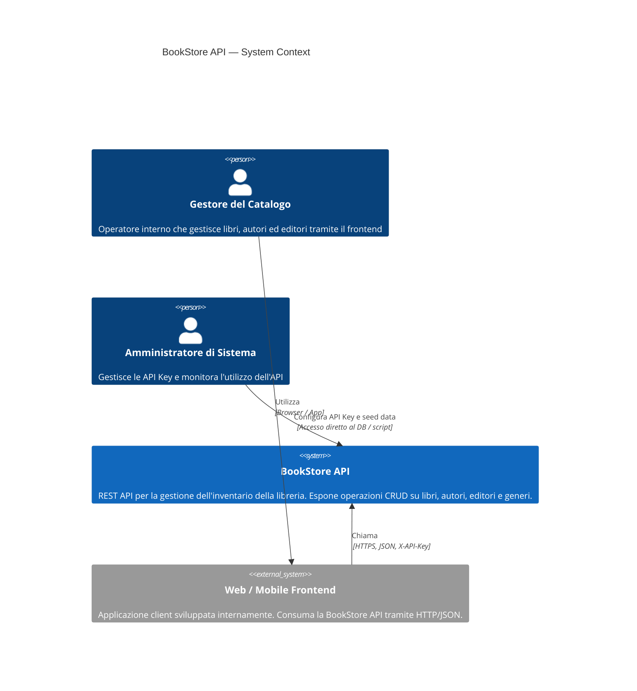
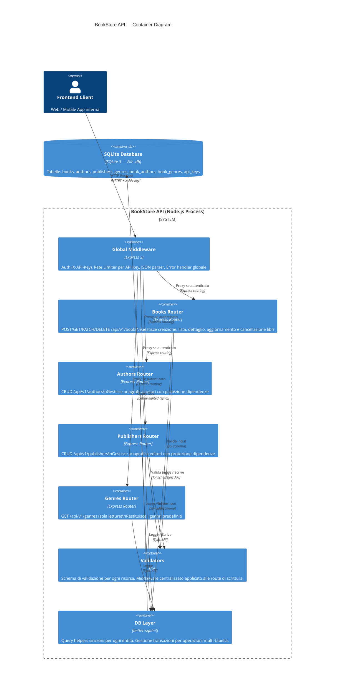
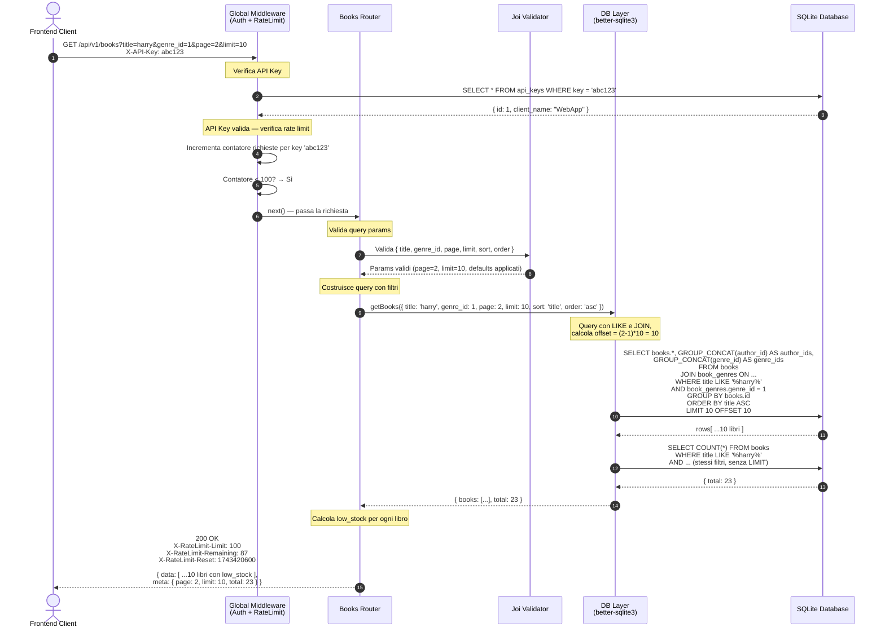
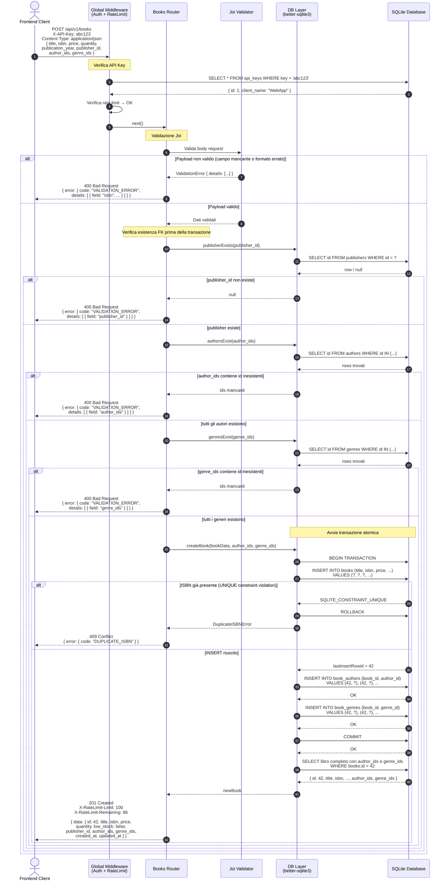

# Diagrammi Architetturali — BookStore API

**Versione**: 1.0  
**Data**: 2026-03-31

---

## 1. C4 — Context Diagram

Mostra il sistema nel suo contesto: chi interagisce con esso e da dove.

---

## 2. C4 — Container Diagram

Mostra i componenti interni del sistema BookStore API e le loro responsabilità.

---

## 3. Sequence Diagram — GET /api/v1/books

Flusso completo di una richiesta lista libri con filtri e paginazione.

---

## 4. Sequence Diagram — POST /api/v1/books

Flusso completo di creazione libro, inclusi validazione, controllo FK e transazione.

---

> I diagrammi C4 richiedono il plugin/renderer Mermaid con supporto `C4Context` / `C4Container` (Mermaid >= 10.x).  
> I sequence diagram sono compatibili con qualsiasi renderer Mermaid standard.
